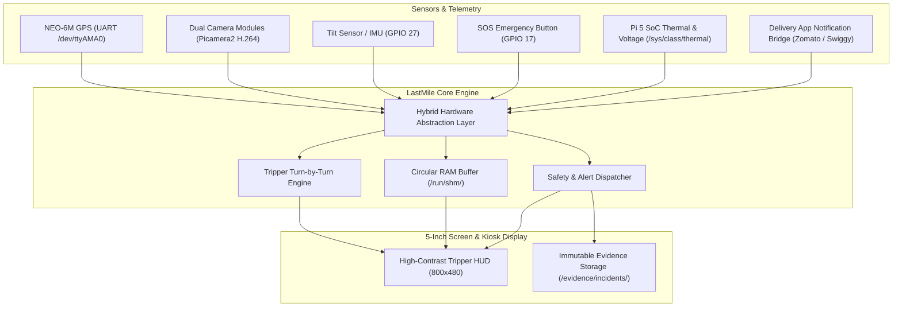

# LastMile Guard 🛵🛡️
> **"Your every Mile. Expertly Engineered."**
> A smart, ruggedized, distraction-free IoT navigation, witness dashcam, and rider safety system for two-wheelers and gig-economy delivery personnel (Zomato, Swiggy, Zepto, Amazon Flex).

---

## 🌟 Overview & Royal Enfield Tripper Inspiration

Inspired by the **Royal Enfield Tripper Navigation System**, **LastMile Guard** transforms any two-wheeler or light vehicle with a dedicated secondary display. It offloads smartphone dependency, protects against bad weather, prevents phone battery drain, and minimizes rider distraction through:

* 🧭 **High-Contrast 5-Inch Tripper HUD**: Glanceable turn-by-turn vector arrows, distance countdown, speed cluster, and compass bearing.
* 📷 **Dual Witness Dashcam (Circular RAM Buffering)**: High-efficiency H.264 rolling buffer in memory (`/run/shm/`) with zero flash wear.
* 🚨 **Crash & Incident Event Locking**: Automatic tilt-detection (>45°) and tactile SOS button that locks 60s pre-event + 30s post-event video to `/evidence/incidents/`.
* 🍔 **Delivery Notification Bridge**: Direct, glanceable banner overlays for incoming **Zomato, Swiggy, Zepto, and customer phone calls**.
* ⚡ **Raspberry Pi 5 SoC Health Sentinel**: Real-time monitoring of CPU temperature (`/sys/class/thermal`), under-voltage warnings, and hardware PWM display dimming.

---

## 🏗️ Architecture & Ponytail Ruleset

Built strictly under the **Ponytail Decision Ladder**:
1. **YAGNI**: Zero bloat, no heavy containers or microservices on the Pi.
2. **Standard Library First**: Native `asyncio`, `sysfs`, `sqlite3`, and `pathlib`.
3. **Hybrid HAL (Hardware Abstraction Layer)**: Runs in **Simulation Mode** (on Windows or Pi with only an HDMI monitor) and automatically switches to **Real Hardware** (`/dev/ttyAMA0`, `Picamera2`, `gpiozero`) when physical modules are detected.



---

## 📁 Repository Structure

```
LastMile-Guard/
├── AGENTS.md                          # Ponytail rules & agent constraints
├── .gitattributes                     # Enforce LF line endings for Linux
├── .gitignore                         # Ignore temporary files & video captures
├── requirements.txt                   # Lean, audited Python dependencies
├── config.json                        # Hardware pins, baudrates & buffer settings
├── main.py                            # Main application entry point
│
├── hal/                               # Hardware Abstraction Layer (HAL)
│   ├── base.py                        # Abstract protocols (GPS, Camera, Sensors, Health)
│   ├── internal_pi.py                 # Real Pi 5 SoC temperature & throttling reader
│   ├── drivers_mock.py                # Virtual simulators for GPS, Camera & Sensors
│   ├── drivers_linux.py               # Native Pi 5 drivers (/dev/ttyAMA0, Picamera2, GPIO)
│   └── factory.py                     # Smart auto-detecting hardware factory
│
├── core/                              # Core Application Engines
│   ├── engine.py                      # Async event coordinator & telemetry stream
│   ├── navigation.py                  # Turn-by-turn Tripper state machine
│   ├── dashcam.py                     # RAM circular buffer & incident exporter
│   ├── delivery_parser.py             # Zomato / Swiggy / Call alert parser
│   └── system_health.py               # Pi 5 thermal & under-voltage sentinel
│
├── ui/                                # Display & Dashboard Interface
│   ├── server.py                      # FastAPI app & low-latency WebSocket broadcaster
│   ├── templates/index.html           # 5-inch Tripper HUD layout with test toolbar
│   └── static/
│       ├── css/tripper.css            # Automotive HUD high-contrast styling
│       └── js/tripper.js              # Real-time WebSocket consumer & SVG vector arrows
│
├── scripts/                           # Cross-Platform Launchers & Installers
│   ├── run_hdmi_test.sh               # Pi 5 HDMI monitor kiosk test launcher
│   ├── setup_ubuntu.sh                # Ubuntu Pi 5 automated setup & installer
│   ├── run_windows.bat                # Windows simulation launcher
│   └── run_windows.ps1                # PowerShell launcher
│
└── tests/
    └── test_all.py                    # Unit tests for HAL, Nav, Dashcam & Alerts
```

---

## 🚀 Getting Started & Testing

### Option 1: 1-Click Setup & Launch on Raspberry Pi 5 (Raspberry Pi OS / Ubuntu)

When downloaded from GitHub onto a **Raspberry Pi 5**, you can set up and run the entire system with a **single command or double-click**:

1. **Clone the Repository**:
   ```bash
   git clone https://github.com/DebanjanTest/Lastmile.git
   cd Lastmile
   ```

2. **1-Click Automated Setup**:
   ```bash
   chmod +x setup_pi.sh run.sh
   ./setup_pi.sh
   ```
   * Installs all system dependencies (`python3-gpiozero`, `python3-rpi.gpio`, `chromium-browser`).
   * Configures virtual environment with hardware bindings.
   * **Creates a Desktop Shortcut on your Pi Desktop (`LastMile Guard HUD`)**.

3. **1-Click Launching**:
   * **Method A (Desktop Icon)**: Simply double-click the **`LastMile Guard HUD`** icon on your Raspberry Pi desktop!
   * **Method B (Terminal / Auto-Run)**: Run `./run.sh` to automatically launch the backend and open the HUD in fullscreen 5.0" Kiosk mode!

4. **Interactive Keyboard Hotkeys on HUD Screen**:
   * `[O]` : Refresh Incoming Multi-App Orders (Zomato / Swiggy / Zepto / Amazon)
   * `[A]` : Opt In / Accept Top Delivery Offer
   * `[R]` : Confirm Reached Store (Collect food)
   * `[K]` : Confirm Food Picked Up (Route to customer)
   * `[U]` : Complete Delivery (Trigger Payment QR & Daily Income popup)
   * `[S]` : Trigger SOS Emergency Alert & Lock Dashcam Video
   * `[T]` : Simulate Vehicle Crash / Tilt Fall
   * `[D]` : Toggle Live Dashcam View (PIP)
   * `[ESC]` : Dismiss Emergency Screen / Close Payment Modal

---

### Option 2: Running 1-Click Simulation on Windows

1. Double-click **`run.bat`** in the project folder.
2. The server will auto-clear port conflicts, launch Python 3.12, and open **`http://localhost:8000`** in your browser.

---

## 🔌 Hardware Pinout Reference (When Wiring Physical Modules)

| Module / Component | Raspberry Pi 5 Physical Pin | GPIO / Interface | Notes |
| :--- | :--- | :--- | :--- |
| **NEO-6M GPS TX** | Pin 10 | GPIO 15 (RXD /dev/ttyAMA0) | Reads 9600 baud NMEA sentences |
| **NEO-6M GPS RX** | Pin 8 | GPIO 14 (TXD /dev/ttyAMA0) | GPS configuration commands |
| **SOS Push Button** | Pin 11 | GPIO 17 | Active Low with internal pull-up |
| **Tilt Sensor / Switch** | Pin 13 | GPIO 27 | Triggers on >45° vehicle angle |
| **Buzzer / Mini Speaker** | Pin 15 | GPIO 22 | Audio turn & emergency alert |
| **Brightness PWM Backlight** | Pin 12 | GPIO 18 (PWM0) | Hardware PWM brightness control |
| **Dual Cameras** | CSI-0 & CSI-1 | MIPI CSI Ribbon Ports | Picamera2 H.264 circular buffer |

---

## 📜 License
Developed for CSE Dept, University of Engineering and Management (UEM), Kolkata. Open source under the MIT License.
